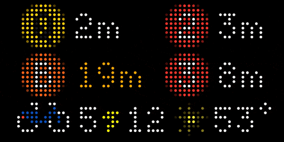

# tidbyt-trains-and-bikes

Tidbyt app to display NYC subway times for multiple stations, Citibike availability, and weather _on one screen_.

<div align="center">
  
</div>

## Contents

<!-- START doctoc generated TOC please keep comment here to allow auto update -->
<!-- DON'T EDIT THIS SECTION, INSTEAD RE-RUN doctoc TO UPDATE -->

- [Running it in Docker](#running-it-in-docker)
- [Running it locally](#running-it-locally)
  - [Pushing to your Tidbyt](#pushing-to-your-tidbyt)
- [FAQ](#faq)
  - [Why not use the official apps?](#why-not-use-the-official-apps)
  - [Why not publish this as a community app?](#why-not-publish-this-as-a-community-app)

<!-- END doctoc generated TOC please keep comment here to allow auto update -->

## Running it in Docker

You can use the following Docker compose file to run the app:

```yaml
services:
  app:
    image: ghcr.io/sloria/tidbyt-trains-and-bikes:latest
    environment:
      CITIBIKE_STATION_ID: "${CITIBIKE_STATION_ID}"
      MTA_STATION_ID1: "${MTA_STATION_ID1}"
      MTA_STATION_ID2: "${MTA_STATION_ID2}"
      MTA_STATION_ROUTES1: "${MTA_STATION_ROUTES1}"
      MTA_STATION_ROUTES2: "${MTA_STATION_ROUTES2}"
      TIDBYT_API_KEY: "${TIDBYT_API_KEY}"
      TIDBYT_DEVICE_ID: "${TIDBYT_DEVICE_ID}"
      TIDBYT_ENABLE_PUSH: "${TIDBYT_ENABLE_PUSH}"
      TIDBYT_INSTALLATION_ID: "${TIDBYT_INSTALLATION_ID}"
      WEATHER_COORDINATES: "${WEATHER_COORDINATES}"
      TEMPERATURE_UNIT: "${TEMPERATURE_UNIT:-F}"
    healthcheck:
      test: ["CMD", "curl", "-f", "http://localhost:8000/health"]
      interval: 30s
      timeout: 10s
      retries: 3
      start_period: 10s
```

Download the annotated `.env` file.

```
curl -o .env https://raw.githubusercontent.com/sloria/tidbyt-trains-and-bikes/main/.env.local.example
```

Update `.env` with your values.

Then run it.

```
docker-compose up -d
```

## Running it locally

Install deps (requires [uv](https://docs.astral.sh/uv/getting-started/installation/)):

```
uv sync
brew install pixlet parallel
```

Copy the .env file:

```
cp .env.local.example .env
```

Modify `.env` with proper values. Variables with the `CHANGEME` placeholder are required.

Run both the API server and the Tidbyt server simultaneously (requires GNU parallel, installed above):

```
make serve
```

Open http://localhost:8080/ to view the TidByt preview app.

### Pushing to your Tidbyt

To actually show the app on your Tidbyt, make sure that `TIDBYT_API_KEY` and `TIDBYT_DEVICE_ID` in `.env`.
You can find these in the Tidbyt mobile app.

```
TIDBYT_API_KEY=CHANGEME
TIDBYT_DEVICE_ID=CHANGME
```

Then run the server with `TIDBYT_ENABLE_PUSH=1`:

```
TIDBYT_ENABLE_PUSH=1 make serve
```

## FAQ

### Why not use the official apps?

Tidbyt's official NYC Subway app limits you to viewing one station at a time. Citibike and weather are separate apps.
Checking all the transit options means waiting for multiple screens. This app consolidates everything I need
into one screen.

### Why not publish this as a community app?

Short answer: This code was written specifically for my apartment. I’m not particularly interested in supporting community usage.

Slightly longer answer: Tidbyt's Starlark SDK has limitations when it comes to querying complex APIs like the MTA's GTFS feed. This requires the use of a proxy server, which means the app is no longer purely Starlark-based. I have no desire to expose the proxy server to the internet or have others depend on it for their devices.
